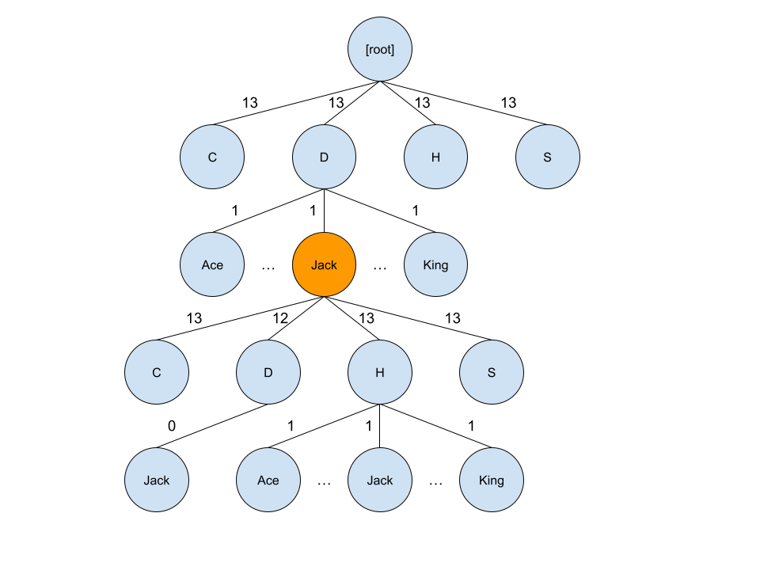

# Poker AI

## Usage

`python main.py player_cards [--table_cards TABLE_CARDS] [--tree_descent {bfs,dfs,djikstra}] [--clustering {kmeans,gd,sa,avg}] [--kmeans_clusters KMEANS_CLUSTERS [-h] [-v]`

Specify two player cards and up to five table cards. Represent cards as comma-separated two character sequences; for example:

- An ace of spades and a two of diamonds: `sa,d2`
- A jack, queen, and king of clubs: `cj,cq,ck`

## Tree Model

All possible game states are represented in a weighted tree.

In the above example, a reference to the orange node is a reference to the game state where the player has a jack of diamonds. All other cards in play are undefined. After reaching that game state, the probability of drawing another diamond-suited card is lowered according to the weight on that edge, and the chance of another jack of diamonds being put into play is eliminated.

As shown, every two layers of the tree define a card in play. From the orange node, the next 2 layers will define the second card in the player's hand; the next 10 define the 5 cards on the table; the next 4 define one opponent's hand, and the final 4 define the other opponent's hand.

Once a node with total depth of 22 is reached, the state of the game is fully defined, and the winner can be determined. Using the tree model, the problem of calculating odds of winning can therefore be stated as follows:

1. Descend the tree to find the game state that matches the known conditions (for instance, if all that is known is that there is a jack of diamonds in the player's hand, we would descend to the orange node)
2. Descend from that node to a number of nodes of depth 22, where the game is fully defined
3. For each of those nodes of depth 22, determine whether it is a winning situation for the player

## Traversing from Known Conditions

The main question in the above process is how to implement step 2. One approach would be to implement a Monte Carlo simulation, where the program descends randomly down the tree based on the probabilities indicated by the weightings on the tree path.

For instance, in the above tree, descending from the orange node, a Monte Carlo simulation would have a 12/(12 + 13 + 13 + 13) chance of descending to another diamonds card and a 13/(12 + 13 + 13 + 13) chance of descending to any other suit.

Of course, to calculate a probability, one Monte Carlo trial will not suffice; many hundreds of trials must be run for sufficiently large tree. With such a high number of trials, a Monte Carlo simulation will likely be accurate, but it will also be inefficient.

To make Monte Carlo more efficient, a smarter algorithm such as breadth-first-search can to first find the couple most likely descendant game state nodes. Monte Carlo then can be run from each of these most likely nodes to produce a probability of winning given the game state encoded by that node. Since there are few of these nodes and they are each at least a few levels down from the known game state node, they have far fewer descendants than the known game state node, and so Monte Carlo does not need as many trials to be accurate.

[example image]

In addition to breadth-first-search, my code implements depth-first-search and a modified version of Djikstra's algoritm for the "smarter algorithm."

## Clustering Resultant Probabilities

After the Monte Carlo simulation probability is calculated for each most likely node found by the smarter algorithm, we get a list of probabilities. We can average this list to get an overall probabilities.

However, this simple approach could run into issues. If 8/10 nodes led to a 20% chance of winning and 2/10 nodes led to a 95% chance of winning, it may be more helpful to know about this high-risk/high-reward situation than simply to know that there is a 35% average chance of winning.

The method used here to achieve this is K-means clustering, which divides the list of probabilities into a set number of clusters and finds the average of each of them. Gradient descent and simulated annealing are also implemented here as an alternative to simple averaging; they provide the number with minimum sum distance to all probabilities in the list.
